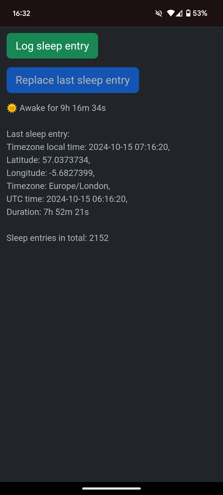

# Sleep Tracker

A simple progressive web app to track sleep.

<p align="center">
    
</p>

## Specifying secrets

Secrets have to be set up before running the project.

Environment variables for `secret/.env` file:

1. `API_KEY` - API key that client will have to provide in order to be able to access the sleep tracker webpage
1. `SPREADSHEET_ID` - Google Sheets spreadsheet ID, e.g. the ID for a spreadsheet with the link https://docs.google.com/spreadsheets/d/13Nig7emkfeSDraasAERmsc82k2i3y4Csdfcazj0kUPcUY/ would be `13Nig7emkfeSDraasAERmsc82k2i3y4Csdfcazj0kUPcUY`
1. `SPREADSHEET_RANGE` - The name of the Google Sheets spreadsheet, e.g. `Sheet1`
1. `PUSHBULLET_API_KEY` - PushBullet API key to send a notification after creating/deleting a sleep entry

Google Sheets API OAuth client credentials for `secret/credentials.json` file also have to be generated at https://console.cloud.google.com/apis/api/sheets.googleapis.com/credentials.
The client ID has to be of type Desktop app.

During first login there will be a command line prompt to log in with Google.
After logging in, a `secret/token.json` file will be generated and the app will have to be restarted in order for it to work.

This command can be used to generate the initial `secret/token.json` file:

```shell
docker run -it --rm -v `pwd`/secret:/usr/src/sleep-tracker/secret -p 8002:8000 mpoc/sleep-tracker
```

After running it, navigate to `http://localhost:8000/sleep?apiKey=<API_KEY>` to trigger the Google login.

## How to run

### Running locally

```shell
yarn install
yarn compile
yarn start
```

### Running using Docker

```shell
docker-compose up -d
```

## How to log sleep

Go to `http://localhost:8000/sleep?apiKey=<API_KEY>` to see the app.

Note that in order to log the sleep entry location, it will have run over HTTPS.
Without HTTPS, this error will happen when trying to access the location:

```text
ERROR(1): Only secure origins are allowed (see: https://goo.gl/Y0ZkNV).
```

## How to build

```shell
docker build -t mpoc/sleep-tracker:latest .
docker push mpoc/sleep-tracker:latest
```
